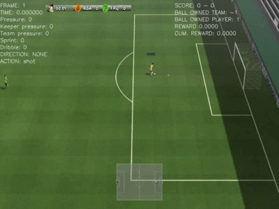

# Google Football Research (PyTorch)
   
This is the pytorch example of the google football research, more contents will be updated soon!
## Requirements
- python-3.6.8
- openai-baselines
- pytorch-1.1.0
- [gfootball](https://github.com/google-research/football)
## TODO List
- [ ] add more tasks and examples - full game is in plan.
- [ ] remove openai-baseline's functions.
- [ ] add more algorithms: **IMPALA** and **Ape-X DQN**.

## Installation
Please install the `gfootball` according to the instructions [here](https://github.com/google-research/football).
1. Make sure your `pip` is less than `19`, the lastest version of `pip` will disable `--process-dependency-links`
```bash
conda install pip==18.1
```
2. Install tensorflow (well, we don't need, but it's required for `gfootball`)
```bash
pip install tensorflow
```
3. Install gfootball
``` bash 
git clone https://github.com/google-research/football.git
cd football
pip3 install .[tf_cpu] --process-dependency-links (we don't need GPU for tensorflow)
```
## How to use the code
Train the simple example - **academy_empty_goal_close**
```bash
python train_example.py
```
Play the demo:
```bash
python demo.py
```
## Demo

